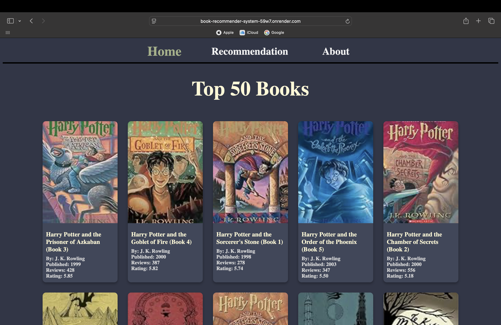
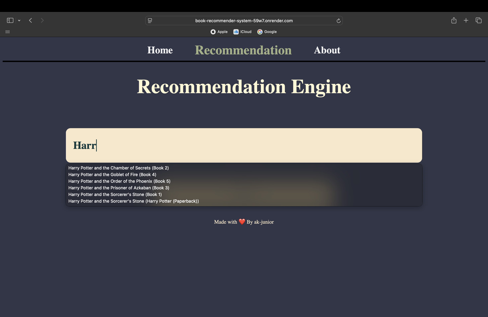
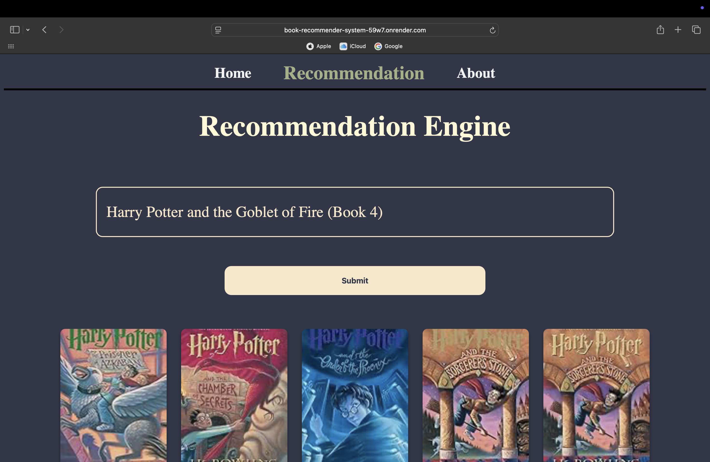
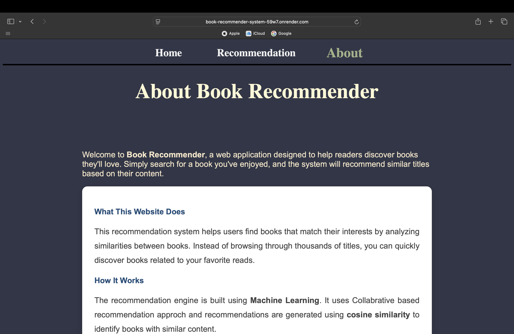

<div align="center">

# Book Recommender System

A Flask-based web application that recommends books to readers using **popularity-based** and **item-based collaborative filtering**. Search for a book you love, and the system suggests similar titles based on real user rating patterns.


**[Live Demo]** https://book-recommender-system-59w7.onrender.com

</div>

---


##  Table of Contents

- [Overview](#-overview)
- [Demo](#-demo)
- [Features](#-features)
- [How It Works](#-how-it-works)
- [Tech Stack](#️-tech-stack)
- [Project Structure](#-project-structure)
- [Getting Started](#-getting-started)
- [Routes / API](#-routes--api)
- [Dataset](#-dataset)
- [Deployment](#-deployment)
- [Roadmap](#-roadmap)
- [Contributing](#-contributing)
- [License](#-license)
- [Credits](#-credits)

---

## Overview

**Book Recommender System** helps readers discover their next favorite book without endless scrolling. Instead of browsing thousands of titles, users search for a book they already enjoyed, and the app instantly returns similar books based on how *other readers with similar taste* rated them — no genre tags or manual curation required.

The project covers the full ML application lifecycle: data cleaning and EDA, model building (popularity ranking + collaborative filtering), model serialization, and a production-style Flask web interface.

---

##  Demo

<div align="center">

**🔗 Live App:** [https://book-recommender-system-59w7.onrender.com](#)

### Home Page (Top 50)



### Recommendation Page




### About Page



</div>

---

## Features

- **Top 50 Books** — Homepage showcasing the most popular, highly-rated books.
- **Personalized Recommendations** — Enter any book title to get 10 similar recommendations powered by cosine similarity.
- **Live Search Suggestions** — Autocomplete dropdown populated from the trained book catalog.
- **Rich Book Details** — Cover image, author, publication year, review count, and average rating for every book.
- **Responsive UI** — Clean, lightweight interface built with HTML, CSS, and vanilla JavaScript — no heavy frontend framework required.
- **Simple REST API** — JSON endpoints that can be reused by any frontend or client.

---

##  How It Works

The recommendation engine was built and trained in a Jupyter notebook (`book-recommender-system.ipynb`) using the **Book-Crossing dataset** (`Books.csv`, `Users.csv`, `Ratings.csv`), and consists of two models:

### 1. Popularity-Based Recommendation
Books are ranked by average rating, but only among books with **at least 250 ratings** — so a book with a 9.0 rating from just one or two reviews doesn't outrank a book with an 8.5 average from hundreds of reviews. The top 50 results power the homepage.

### 2. Collaborative Filtering (Item-Based)
1. Only **"authentic" users** — those who have rated more than 200 books — are considered, filtering out noisy or unreliable ratings.
2. Only **"famous" books** — those rated by 50 or more users — are kept, ensuring enough data per book.
3. A **user–book pivot table** is built from the filtered data (books as rows, users as columns, ratings as values).
4. **Cosine similarity** is computed between every pair of books based on their rating vectors.
5. When a user searches for a book, the system looks up its similarity scores against all other books and returns the top matches, along with title, author, and cover image.

Trained artifacts (`popular.pkl`, `books.pkl`, `pt.pkl`, `similarity_score.pkl`) are serialized with `pickle` and loaded once by the Flask app at startup for fast lookups.

```
Raw Data (Books, Users, Ratings)
        │
        ▼
  Cleaning & EDA (pandas, seaborn)
        │
        ├──► Popularity Model ──► popular.pkl
        │
        └──► Collaborative Filtering
                 │
                 ├─ Pivot Table (pt.pkl)
                 ├─ Cosine Similarity (similarity_score.pkl)
                 └─ Book Metadata (books.pkl)
                          │
                          ▼
                  Flask App (index.py)
                          │
                          ▼
              Web UI (index / recommend / about)
```

---

##  Tech Stack

| Layer               | Technology                            |
|---------------------|----------------------------------------|
| Backend             | Python, Flask                          |
| Data Processing     | Pandas, NumPy                          |
| Machine Learning    | scikit-learn (cosine similarity)       |
| Model Persistence   | Pickle                                 |
| Frontend            | HTML, CSS, JavaScript (Fetch API)      |
| Notebook / EDA      | Jupyter Notebook, Seaborn, Matplotlib  |
| Deployment          | Render

---

## Project Structure

```
book-recommender-system/
│
├── api/
│   └── index.py                    # Flask application & routes
│
├── template/
│   ├── index.html                  # Homepage — Top 50 books
│   ├── recommend.html              # Recommendation search page
│   └── about.html                  # About page
│
├── static/
│   └── style.css                   # Stylesheet
│
├── Models/
│   ├── popular.pkl                 # Popularity-based model data
│   ├── books.pkl                   # Book metadata
│   ├── pt.pkl                      # User–book pivot table
│   └── similarity_score.pkl        # Precomputed cosine similarity matrix
│
├── docs/
│   └── screenshots/                # README screenshots (optional)
│
├── book-recommender-system.ipynb   # Data cleaning, EDA & model training
├── requirements.txt                # Python dependencies
└── README.md
```


---

## Getting Started

### Prerequisites
- Python 3.8+
- pip
- (Optional) Jupyter Notebook, if you want to retrain the models

### Installation

1. **Clone the repository**
   ```bash
   git clone https://github.com/<your-username>/book-recommender-system.git
   cd book-recommender-system
   ```

2. **Create a virtual environment (recommended)**
   ```bash
   python -m venv venv
   source venv/bin/activate      # On Windows: venv\Scripts\activate
   ```

3. **Install dependencies**
   ```bash
   pip install -r requirements.txt
   ```
   Or manually:
   ```bash
   pip install flask pandas numpy scikit-learn gunicorn
   ```

4. **Generate the trained model files**

   Run all cells in `book-recommender-system.ipynb` (with `Books.csv`, `Users.csv`, and `Ratings.csv` in the same directory) to generate:
   - `popular.pkl`
   - `books.pkl`
   - `pt.pkl`
   - `similarity_score.pkl`

   Then place these four files inside a `Models/` folder at the project root.

5. **Run the app locally**
   ```bash
   python app/index.py
   ```

6. **Open your browser** and navigate to:
   ```
   http://127.0.0.1:5000/
   ```

---

## Routes / API

| Route               | Method | Description                                                 |
|---------------------|--------|---------------------------------------------------------------|
| `/`                 | GET    | Homepage — displays the Top 50 popular books                  |
| `/recommend`        | GET    | Renders the recommendation search page                        |
| `/books_r`          | GET    | Returns a JSON list of all book titles (for autocomplete)     |
| `/recommend_movies` | POST   | Accepts `{ "movie": "<book title>" }` and returns 10 similar books as JSON |
| `/about`            | GET    | About page with project information                           |

**Example request:**
```bash
curl -X POST http://127.0.0.1:5000/recommend_movies \
  -H "Content-Type: application/json" \
  -d '{"movie": "1984"}'
```

**Example response:**
```json
[
  ["Animal Farm", "George Orwell", "http://images.amazon.com/images/..."],
  ["Brave New World", "Aldous Huxley", "http://images.amazon.com/images/..."]
]
```

Each item in the response array is `[Book-Title, Book-Author, Image-URL-M]`.

---

## Dataset

This project uses the ** https://www.kaggle.com/datasets/arashnic/book-recommendation-dataset **, consisting of three files:

Key cleaning steps performed in the notebook:
- Verified no duplicate rows across all three datasets.
- Filtered users and books by rating count thresholds to ensure statistically meaningful recommendations (see [How It Works](#-how-it-works)).

---

##  Deployment

The app is a standard Flask application and is deployed on Render


---

## Contributing

Contributions are welcome and appreciated!

1. Fork the project
2. Create your feature branch (`git checkout -b feature/amazing-feature`)
3. Commit your changes (`git commit -m 'Add some amazing feature'`)
4. Push to the branch (`git push origin feature/amazing-feature`)
5. Open a Pull Request

Please open an issue first for major changes to discuss what you'd like to change.

---

## License

Distributed under the **MIT License**

---

##  Credits

Made with ❤️ by **ak-junior**


If you found this project useful, consider giving it a ⭐ on GitHub!